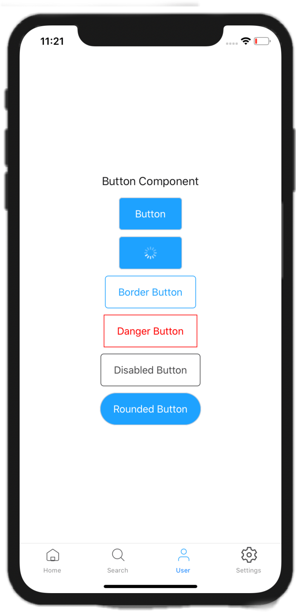
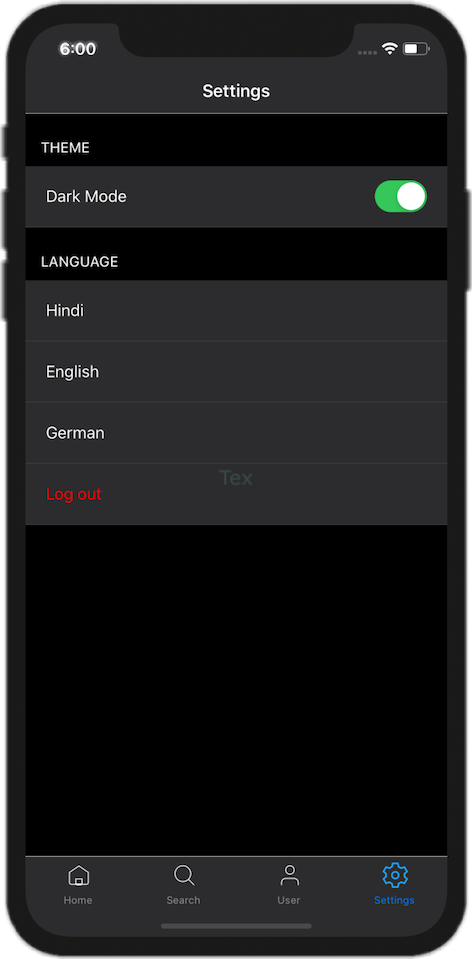

# react-native-app-builder

This project is a React Native boilerplate that can be used to kickstart a mobile application.

The boilerplate provides **an optimized architecture for building solid cross-platform mobile applications** through separation of concerns between the UI and business logic. It contains redux, saga, context, theme, localization, tabs and stack navigation.

<br/>

## Getting Started

```
$ npx react-native-app-builder <ProjectName>

$ cd <ProjectName>

$ npx react-native run-ios

$ npx react-native run-android
```

<br/>

## Directory Structure

```
root
├── __tests__
├── android
├── ios
└── App
    └── Actions
    |   ├── Keys
    └── ApiConfig
    └── AppContext
    └── Localization
    └── Reducers
    |   ├──Default
    └── Routes
    └── Sagas
    └── Screens
    |    CommonComponent
    |    Components
    |    SubComponents
    └── Services
    └── Stores
    └── Theme
    |    Images
    └── Utils
├── fastlane
├── .env
...
```

<br/>

## Preconfigured with

- Latest react native version

- Redux saga with persistReducer

- Localization

- Theme support (Dark / Light)

- Utility for validations and error messages

- Custom font and font size for maintain typography

- .env setup

- Support different env for PRODUCTION and DEVELOPMENT

- User Authemntication flow

- UI for Login, Tabs and Settings

<br/>

## Login UI


## Tab Navigator with Button Component



## Settings


